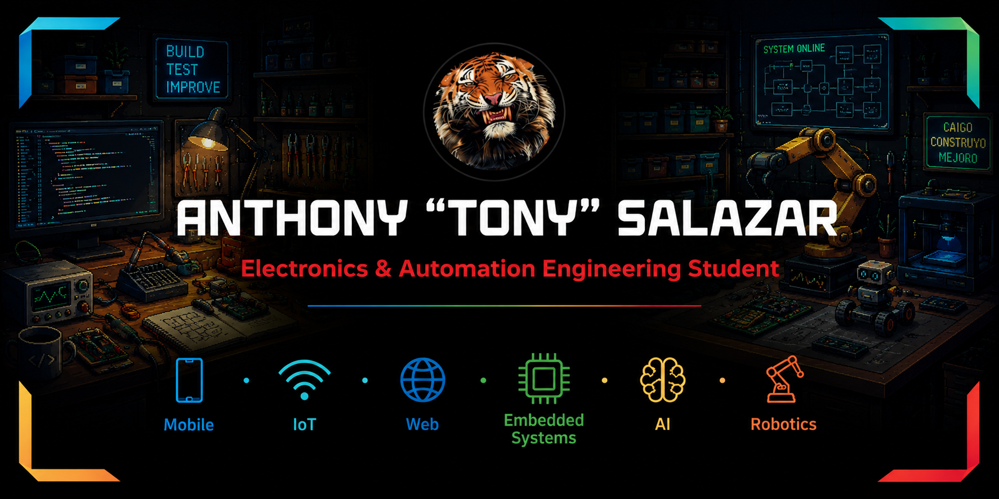

# ¡Hola! 👋

### 🚀 Futuro ING

Soy un apasionado del mundo maker y la ingeniería. Me enfoco en conectar el mundo físico con el digital, creando desde firmware, circuitos y mecanismos con el fin de construir un mundo mejor.

---

### 💻 Lenguajes de Programación

---

### 🌐 Desarrollo Web

### 📱 Desarrollo Móvil

---

### ⚡ Electrónica & Embedded Systems

---

### 🛠️ Herramientas de Hardware, CAD & Entornos

---

## ⭐ Proyectos Destacados

<table>
  <tr>
    <td width="500px" align="left">
      <h3>⚡ Generador de Señales Cuadradas con ESP32-S3</h3>
      
Firmware y control para generación precisa de señales cuadradas utilizando las capacidades de temporización del ESP32-S3.

      

        
        
        
      

      <a href="https://github.com/anthonysalazarv/Generador_Senales_Cuadradas_Con_ESP32s3"><b>🔍 Ver Repositorio →</b></a>
    </td>
  </tr>
</table>

---

### 📊 Estadísticas de GitHub

  
  

  
  

---

### 📬 ¡Contactame!

  
  

